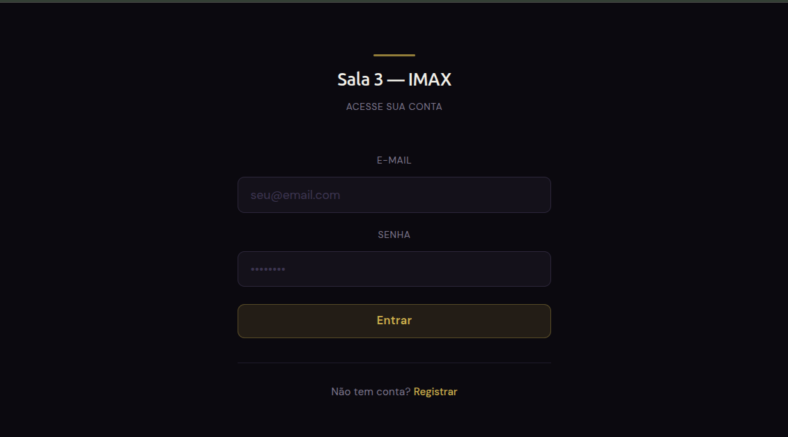
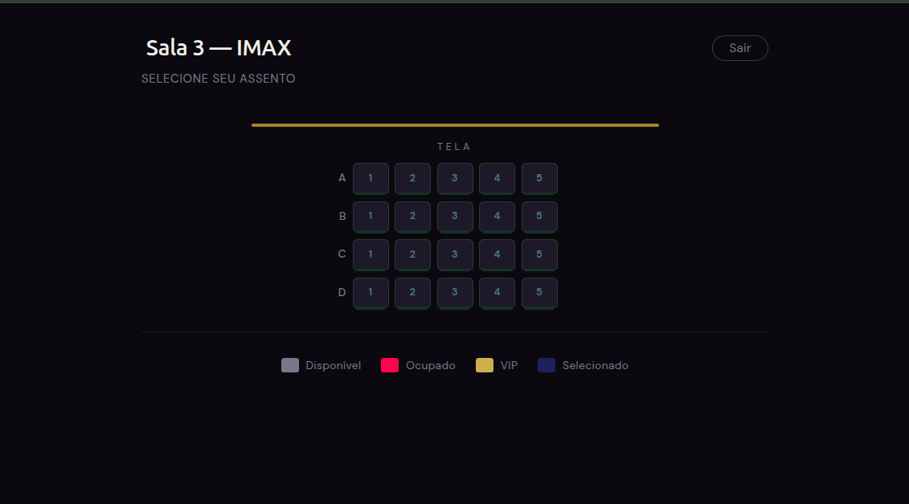
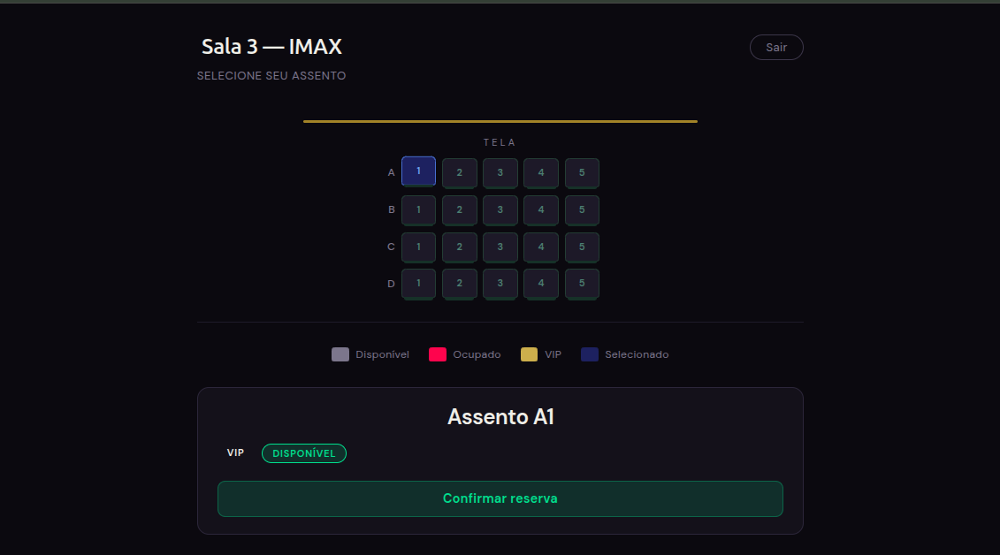
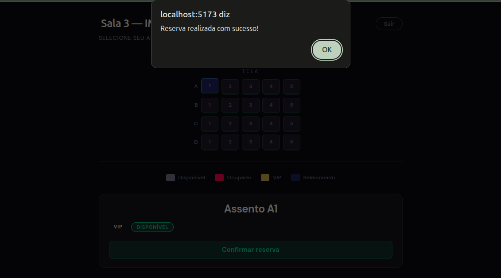
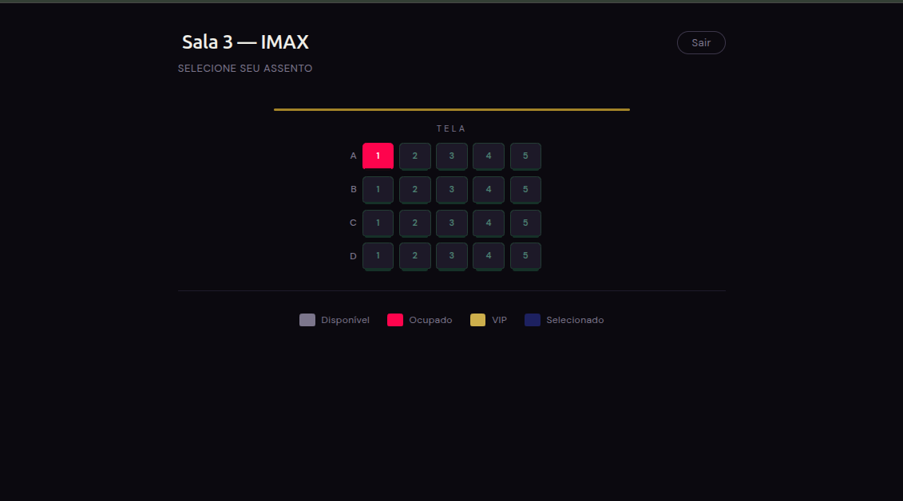
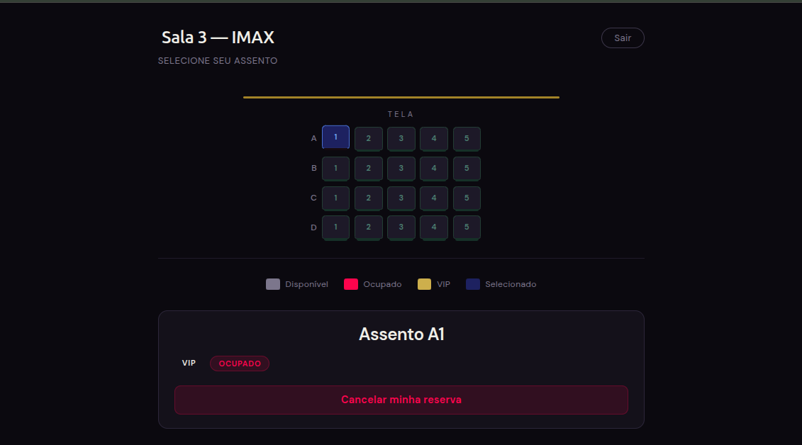
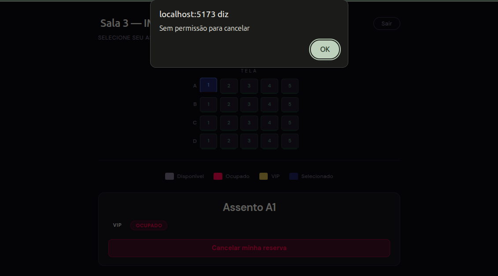

# Sistema de Reserva de Cinema

Projeto desenvolvido para a disciplina de Sistemas Distribuídos.

## Objetivo

Implementar um sistema distribuído de reserva de assentos de cinema, utilizando:

- Frontend separado do backend
- Comunicação via API REST
- Autenticação de usuários
- Persistência de dados em nuvem

---

## Arquitetura

O projeto segue uma arquitetura cliente-servidor:

client (Vue 3) → server (Node.js/Express) → Supabase (Banco + Auth)

---

## Tecnologias Utilizadas

### Frontend
- Vue 3
- Vite
- Axios

### Backend
- Node.js
- Express
- Supabase JS

### Banco de Dados
- Supabase

### Autenticação
- Supabase Auth (email/senha)

---

## Funcionalidades

-  Login de usuário
-  Visualização de assentos
-  Assentos disponíveis
-  Assentos ocupados
-  Reservar assento
-  Cancelar reserva
-  Atualização em tempo real

---

## Estrutura do Projeto

SD_Trabalho1/
├── client/
│   ├── .vscode/
│   ├── node_modules/
│   ├── public/
│   ├── src/
│   │   ├── assets/
│   │   ├── components/
│   │   ├── services/
│   │   ├── App.vue
│   │   ├── main.js
│   │   ├── style.css
│   │   └── supabase.js
│   ├── .gitignore
│   ├── index.html
│   ├── package-lock.json
│   ├── package.json
│   ├── README.md
│   └── vite.config.js
└── server/
    ├── node_modules/
    ├── .env
    ├── package-lock.json
    ├── package.json
    ├── server.js
    └── README.md

---

## Como Executar o Projeto

### Pré-requisitos

- Node.js instalado
- npm install
- Conta no Supabase

---

## 1. Clonar o repositório

git clone https://github.com/seu-usuario/seu-repo.git
cd SD_Trabalho1

2. Criar o Backend
cd server
npm install

Crie um arquivo .env:

SUPABASE_URL= sua_url_aqui
SUPABASE_ANON_KEY= sua_key_aqui
PORT=3000

Rodar o Backend
node server.js

3. Rodar o Frontend
cd client
npm install
npm run dev

Acesse no navegador:
http://localhost:5173

-------

## Estrutura do Banco de Dados

Tabela: assentos

CREATE TABLE assentos (
    id SERIAL PRIMARY KEY,
    identificador VARCHAR(3) UNIQUE NOT NULL, 
    status BOOLEAN DEFAULT false, 
    categoria VARCHAR(10) NOT NULL CHECK (categoria IN ('Normal', 'VIP'))
);

Exemplo de Dados

INSERT INTO assentos (identificador, status, categoria) VALUES
    ('A1', true, 'VIP'), ('A2', true, 'VIP'), ('A3', true, 'VIP'), ('A4', true, 'VIP'), ('A5', true, 'VIP'),
    ('B1', true, 'Normal'), ('B2', true, 'Normal'), ('B3', true, 'Normal'), ('B4', true, 'Normal'), ('B5', true, 'Normal'),
    ('C1', true, 'Normal'), ('C2', true, 'Normal'), ('C3', true, 'Normal'), ('C4', true, 'Normal'), ('C5', true, 'Normal'),
    ('D1', true, 'Normal'), ('D2', true, 'Normal'), ('D3', true, 'Normal'), ('D4', true, 'Normal'), ('D5', true, 'Normal');

## 📸 Prints do Sistema

### Tela de Login

### Tela de Assentos

### Assento Selecionado

### Reserva realizada

### Reserva realizada

### Selecionar Reservada

### Reserva cancelada
